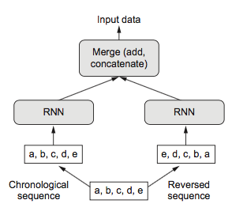
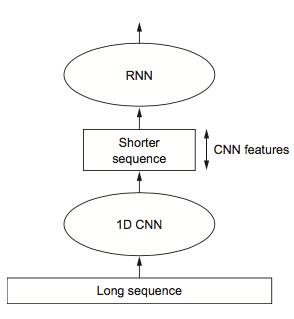

footer: univ.ai
autoscale: true

#[fit] Language and
#[fit] Other Temporal things
#[fit] Recurrent Nets


---


## Language Modeling

Predict the next word. We'll start with random "weights" for the embeddings and other parameters and run SGD. How do we set up a training set?


---

## Dealing with Sequences


This is a windowed dataset, with a window of size 4 and overlapping windows


---


## Structure of a SimpleRNN


Input size: 3, State size: 5, Output size: 4

"*An input of 3 values is processed simultaneously by five neurons lettered A to create a list of 5 values. This is added, element by element, to the state. This result then goes through five neurons lettered B to create a new state, which then goes into the delay step. The result of the addition also goes into the 4 neurons lettered C to produce an output.*"

(Glassner, Andrew. Deep Learning, Vol. 2: From Basics to Practice)

---

## Outputs from RNNs


---

## Keras example

```python
max_features = 10000
maxlen = 500
batch_size = 32

(input_train, y_train), (input_test, y_test) = imdb.load_data(num_words=max_features)
input_train = sequence.pad_sequences(input_train, maxlen=maxlen)
input_test = sequence.pad_sequences(input_test, maxlen=maxlen)

model = Sequential() 
model.add(Embedding(max_features, 32)) 
model.add(SimpleRNN(32)) 
model.add(Dense(1, activation='sigmoid'))
```

---

## From Simple RNNs to LSTMs

 

 

---

## The main idea behind LSTM


- takes short term memory and makes it longer
- The key is the cell state, the horizontal line running through the top of the diagram.
- memory runs straight down the entire chain
- a key innovation is the gate, which only allows partial information through

---

## The forget gate


---

# Remembering.

- a sigmoid layer called the “input gate layer” $$i_t$$ that decides which values we’ll update.
- a tanh layer creates a vector of new candidate values, $$\tilde{C}_t$$ that could be added to the state. 


---

# How is the state updated?


Multiply old state $$C_{t-1}$$ by $$f_t$$ to forget things, then add that to $$\tilde{C}_t$$, the new candidate value, multiplied by $$i_t$$


---

## The output or selected values


Output is a filtered version of the cell state. First, sigmoid to decide what parts of the cell state to output. Then multiply by tanh(cell_state).

---

## GRU


Combines forget and input gates into single “update gate.” Merges the cell state and hidden state. Faster. Try Both.

---

## Keras Example

```python
max_features = 10000
maxlen = 500
batch_size = 32

(input_train, y_train), (input_test, y_test) = imdb.load_data(num_words=max_features)
input_train = sequence.pad_sequences(input_train, maxlen=maxlen)
input_test = sequence.pad_sequences(input_test, maxlen=maxlen)

model = Sequential() 
model.add(Embedding(max_features, 32)) 
model.add(LSTM/GRU/CuDNNLSTM/CuDNNGRU(32)) 
model.add(Dense(1, activation='sigmoid'))
```
---

## Dropout and Recurrent Dropout

```python
from keras.models import Sequential
from keras import layers
from keras.optimizers import RMSprop
model = Sequential()
model.add(layers.GRU(32,
                     dropout=0.2,
                     recurrent_dropout=0.2,
                     input_shape=(None, float_data.shape[-1])))
model.add(layers.Dense(1))
model.compile(optimizer=RMSprop(), loss='mae')
history = model.fit_generator(train_gen,
                              steps_per_epoch=500,
                              epochs=40,
                              validation_data=val_gen,
                              validation_steps=val_steps)
```

`dropout` is for input layers, `recurrent_dropout` for the lstm itself. `recurrent_dropout` keeps dropped layer structure through time.

---

## Stacking Recurrent Layers

```python
model = Sequential()
model.add(layers.GRU(32,
                     dropout=0.1,
                     recurrent_dropout=0.5,
                     return_sequences=True,
                     input_shape=(None, float_data.shape[-1])))
model.add(layers.GRU(64, activation='relu',
                     dropout=0.1,
                     recurrent_dropout=0.5))
model.add(layers.Dense(1))
```

No longer overfitting but not improving? Consider increasing the capacity of the network. Recurrent stacking builds more-powerful recurrent networks. e.g. Google Translate: seven large LSTM layers.

---

## Bi-directional LSTMS

RNN trained on reversed sequences will learn different representations than one trained on the original sequences.



```python
model = Sequential() 
model.add(layers.Embedding(max_features, 32)) 
model.add(layers.Bidirectional(layers.LSTM(32))) 
model.add(layers.Dense(1, activation='sigmoid'))
```

Works on non-chronological tasks in language

---

## CNN-LSTM architectures

- Combine the speed and lightness of convnets with the order-sensitivity of RNNs
- use a 1D convnet as a preprocessing step before an RNN (see figure 6.30). 
- beneficial when you’re dealing with very long sequences 
- convnet: downsampled sequences of higher-level features
- sequence of extracted features is input to
the RNN part of the network.

```python
model = Sequential()
model.add(layers.Conv1D(32, 5, activation='relu',
                        input_shape=(None, float_data.shape[-1])))
model.add(layers.MaxPooling1D(3))
model.add(layers.Conv1D(32, 5, activation='relu'))
model.add(layers.GRU(32, dropout=0.1, recurrent_dropout=0.5))
model.add(layers.Dense(1))
```




